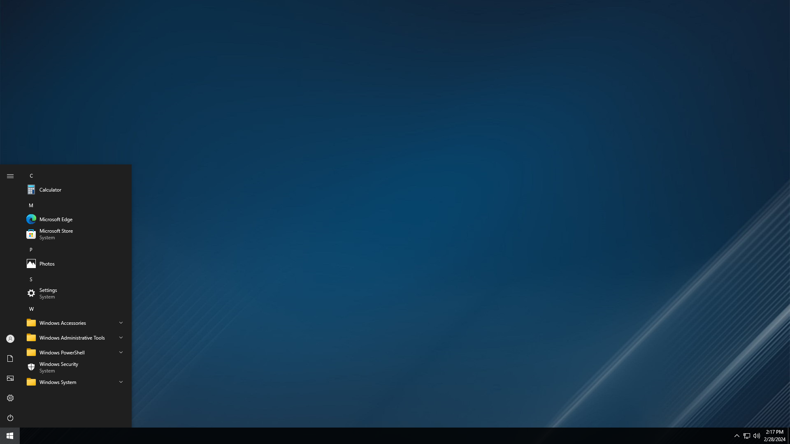

<div align="center">
  <picture>
    <source media="(prefers-color-scheme: dark)" srcset="./assets/brand/large-banner.png" height=200px>
    <source media="(prefers-color-scheme: light)" srcset="./assets/brand/large-banner.png" height=200px>
    
  </picture>
  <h1>Windex</h1>
    


  <br/><br/>
</div>

Use Windex to clean Windows of as much bloat and telemetry as possible without impeding normal function. Windex was built with **stable** and **easily auditable** virtualization in mind, but we're starting to use it on workstations as well, providing a QOL boost.



### 📦 Package debloat

Windex automates the removal of both [metro](./defs/metro/) and [modern](./defs/winget/) applications through the use of manifests. AppX/Metro applications are further deprovisioned to (hopefully) prevent their reinstallation for new users.

Legacy applications and services are purged or disabled. Internet Explorer, MS Paint, WordPad, all removed.

### 🌲 Service pruning

Undesirable Windows services are disabled, removed, or blacklisted. This has a positive effect on performance and reduces baked-in telemtry. We're also working on removing certain protected but undesirable services, such as the Microsoft Account nagger (for local users).

### 🖥️ Virtualization and optional tweaks

Windex was designed with a heavy focus on virtualization. When ran inside of a known hypervisor, Windex can detect which guest tools to install and retrieve them automatically, simplifying the build process.

For advanced use cases, Windex has several normally-hidden tweaks available. Defender Firewall and Defender AV management, Windows update service management, etc.

### 📗 Playbook support

Despite YAML not being natively supported by PowerShell, Windex has a parser built in with easily extendable Ansible-style [playbooks](./defs/README.md#playbooks).

## Basic use

> [!WARNING]
> While Windex was designed with stability and usability in mind, not everyone's environments and workflows are the same. Taking a snapshot or backup beforehand is considered best practice.

Must be ran in an **elevated** PowerShell instance. **Reboot when complete.**

```powershell
Set-ExecutionPolicy Bypass -Scope Process # Confirm with Y or A

& ./windex.ps1 # User will be presented with an interactive menu
```

### Direct call via PowerShell

```powershell
# When pasting is available, copying this may be quicker than dealing with Edge's first-launch "welcome"
# Fetches the latest stable release, not the latest commit

Set-ExecutionPolicy Bypass -Scope Process # Confirm with Y or A
Invoke-WebRequest -Uri "https://api.github.com/repos/ppfeister/windex/releases/latest" `
| Select-Object -ExpandProperty Content `
| ConvertFrom-Json `
| Select-Object -ExpandProperty zipball_url `
| %{
    Invoke-WebRequest -Uri "$_" -OutFile "windex-stable.zip"
  }
Expand-Archive -Path "windex-stable.zip" -DestinationPath .
cd ppfeister-Windex-*
& .\windex.ps1

```


## Detailed documentation

- [Manifests and playbooks](defs/README.md)
- Further documentation in progress

## Planned development

- [x] Adopt playbooks for easier expansion and maintenance
- [ ] Remove additional telemetry **(in progress)**
- [ ] Escalate to SYSTEM or TI without triggering UAC and without psexec to disable certain protected services
- [ ] Create some sort of deployment pipeline for easier fetch and exec (possibly to one of the Windows package managers)
- [x] Add normally-hidden tweak for the installation of hypervisor guest agents **(KVM/QEMU support added!)**